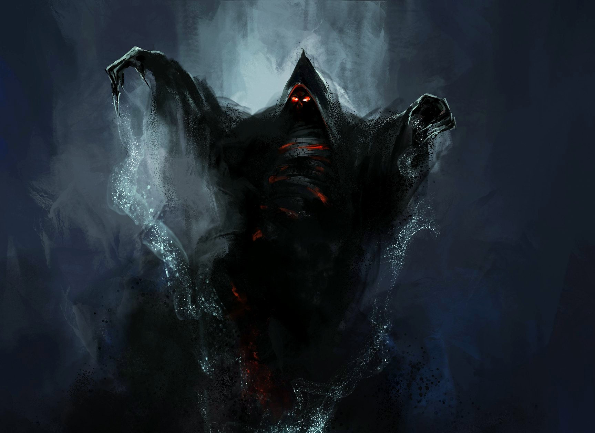

# Epic Website

Welcome to the **Epic Website** project! This website is a fun and creative exploration featuring a fictional company, "Evil Corporation," and its enigmatic CEO, the OVERLORD. The project showcases various HTML and CSS techniques, including custom styling and responsive design.

## Features

- **Header Navigation**: Links to different sections of the website.
- **Hero Section**: A bold introduction to the OVERLORD.
- **Dynamic Content**: Engaging text that adds to the narrative of the OVERLORD's story.
- **Call to Action**: An invitation for users to apply to the fictional corporation.
- **Responsive Design**: Optimized for various screen sizes.

## Preview

 <!-- Include a relevant preview image -->

## Technologies Used

- HTML
- CSS
- Google Fonts

## Disclaimer

[Please understand that this page was made for fun, and please don't take it seriously.]
